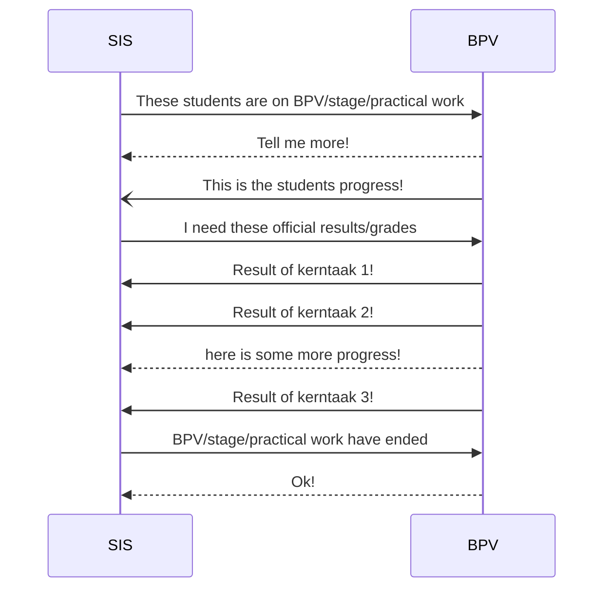

# OKBpv-Begeleiding
OKB koppeling voor BPV begeleiding

## Note: Legal status of the specifications in this repository
 > All information in this repository is draft. No rigths can be claimed based on this information
 > The standards can change without notice until they are finalised and approved

## Abstract
In 2022 -2024 the OKE koppeling was developed in the dutch vocational education market. The OKE focussed on exams and test en finally resulted in an edustandard that is implemented bij many commercial parties to support the schools.
[OKE koppeling MBO ](https://www.edustandaard.nl/standaard_afspraken/onderwijs-koppelingen-examinering-mbo/oke-mbo-1-0/)

The next big topic is the information flows for the period a student is learning inside a company, the BPV (beroeps praktijk Vorming). Crucial information about which student is working in which company, in which period, who will coach the student, what is expected, what is the progress are all important informtaion that flows between several information systems. The BPVx koppeling will standardise this in the same way the OKE koppeling did this for exams. Both standards are based on the OOAPI (open onderwijs API) https://openonderwijsapi.nl 

## Structure of this repository

This repository consists of the following elements:
- [High level domain model](doc/domainmodel.md) for the high level domain model that translates the BPV concepts into OOAPI expressions.
- [Technical reference](doc/technical-reference.md) with information about the architecture, used standards and links to the reference files.
- [OOAPI Specification relevant to this project](specification/v5/docs.html)
- Implementation documentation (to be done)

## Working Documents
- [All working documents can be found in the documents folder](doc/documents/)

## Version history

| Version | Date | Status | Author | Comment |
|---|---|---|---|---|
| 0.1 | najaar 2024 | DRAFT | [@mcginkel](https://github.com/mcginkel) | |

## Contributors

This standard is developed by members from schools, software partners and NED. The contributors are:

| Name | Organization | contact |
|---|---|---|
| Kees van Ginkel | Topicus (EduArte)  | [@mcginkel](https://github.com/mcginkel) -  kees@vanginkels.com |
