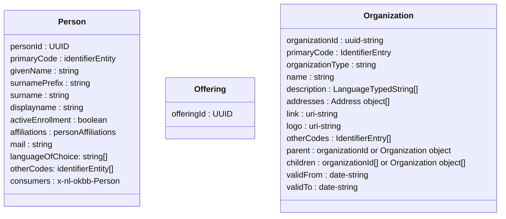

# Dit is het relevante highlevel domain model uitgedrukt in OOAPI v5

```mermaid
classDiagram

    class Person {
        personId : UUID
        primaryCode : identifierEntity
        givenName : string
        surnamePrefix : string 
        surname : string
        displayname : string
        activeEnrollment : boolean 
        affiliations : personAffiliations
        mail : string
        languageOfChoice: string[]
		otherCodes: identifierEntity[]
    	consumers : x-nl-okbb-Person
    }

    class Offering {
       offeringId : UUID
    }
    class Organization {
        organizationId : uuid-string
        primaryCode : IdentifierEntry
        organizationType : string
        name : string
        description : LanguageTypedString[]
        addresses : Address object[]
        link : uri-string
        logo : uri-string
        otherCodes : IdentifierEntry[]
        parent : organizationId or Organization object
        children : organizationId[] or Organization object[]
        validFrom : date-string
        validTo : date-string
    }

    

```
