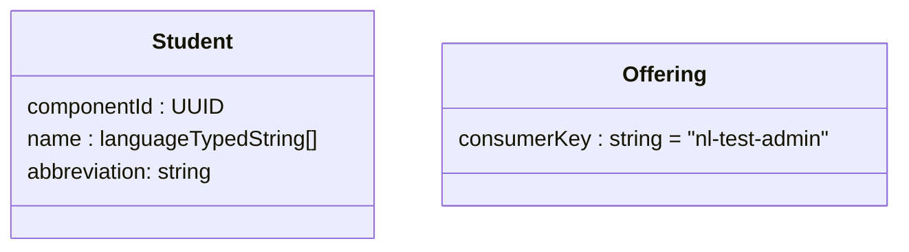

# This is the highlevel domain model

```mermaid
classDiagram
    class Student {
    	componentId : UUID
      name : languageTypedString[]
      abbreviation: string
    }
    class `Offering` {
    	consumerKey : string = "nl-test-admin"

    }
```
